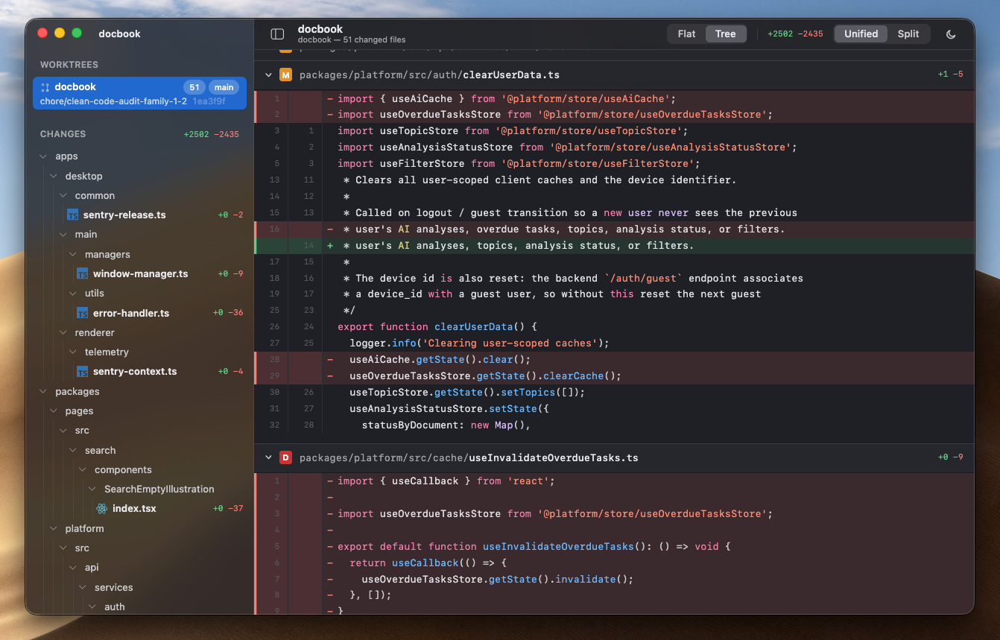

<div align="center">

<h1>GitBench</h1>

<p><strong>A desktop diff viewer for parallel, agent-driven Git worktree workflows.</strong></p>

<p>
Pick a repository, browse its worktrees in a sidebar, and read the uncommitted diff of any of them — without <code>cd</code>-ing around and running <code>git diff</code> by hand.
</p>

<p>
  <a href="LICENSE"></a>
  <a href="https://github.com/tugkanpilka/gitbench/actions/workflows/ci.yml"></a>
  
  
  
  <a href="CONTRIBUTING.md"></a>
</p>

</div>

---

## Why GitBench

You're running coding agents in parallel. Each one works in its own [Git worktree](https://git-scm.com/docs/git-worktree) — a separate checkout of the same repository, so several branches can change at once without colliding. That's the right way to scale up agentic work. The catch is **keeping track of what changed where.**

Worktrees scatter across sibling directories, and the only built-in way to see an agent's progress is to `cd` into its checkout and run `git diff` — for every worktree, repeatedly, as the agents churn. GitBench replaces that loop with one window:

- **One sidebar, every worktree.** See all of a repository's worktrees at a glance, with branch, HEAD SHA, and main/locked/detached status.
- **One click, the full diff.** Select a worktree and read staged, unstaged, untracked, and deleted files together in a fast, readable diff pane.
- **Built for watching agents work.** Filesystem and Git metadata changes refresh the selected worktree automatically.

Open source, MIT-licensed, and TypeScript everywhere.

## Screenshot

<p align="center">
  
</p>

## Features

- **Repository picker** — choose any local Git repository via the system folder dialog.
- **Worktree sidebar** — every worktree of the repository as a flat list (they're sibling checkouts, not a hierarchy), with branch name, HEAD SHA, and main/locked/detached status. Works whether you open the main worktree or a linked one.
- **Diff viewer** — the selected worktree's staged, unstaged, untracked, and deleted files in one unified view. A clean worktree shows a dedicated empty state, not an error. Binary changes, empty files, and renames are tolerated.
- **Automatic refresh** — filesystem and Git metadata changes trigger a debounced re-query, so agent output appears without a manual refresh loop.

> GitBench requires `git` on your `PATH` — it drives the system Git CLI rather than bundling a Git implementation ([how](#how-gitbench-talks-to-git)).

## Getting started

**Prerequisites:** [Node.js](https://nodejs.org) 22+ and a system [Git](https://git-scm.com) (2.25+) on your `PATH` — GitBench drives the Git CLI rather than bundling one.

```bash
npm install
npm run dev          # electron-vite dev mode
npm run build        # production build
npm run typecheck    # all targets: main / preload / renderer
npm run test         # vitest — domain, application, and parsers run without Electron
npm run lint
```

## Architecture

Clean Architecture, with the Electron process boundaries as delivery adapters:

```text
renderer → preload (window.api) → main IPC handlers → application → domain
                                                    │
                                                    └→ infrastructure implements application ports
```

- `src/domain` and `src/application` are pure TypeScript — no `electron`, no `node:*`. Side effects live behind application ports, implemented in `src/infrastructure`.
- `src/contracts/ipc` holds the channel names, DTOs, and the `Result<T>` envelope. Nothing throws across IPC; handlers return `Result<T>`, and domain entities never cross the boundary.
- `ipcRenderer` exists in exactly one file: `src/preload/index.ts`. The renderer talks only to `window.api`. `contextIsolation: true`, `nodeIntegration: false`.
- The MVP surface is three IPC channels: `repo:pick`, `worktrees:list`, `diff:get`.
- Diffs are rendered with [`react-diff-view`](https://github.com/otakustay/react-diff-view), which consumes git's unified diff output directly.

Details live in `agent_docs/`:

| Document                                                   | Covers                                                            |
| ---------------------------------------------------------- | ----------------------------------------------------------------- |
| [`agent_docs/architecture.md`](agent_docs/architecture.md) | Layer rules, import matrix, directory layout, testing strategy    |
| [`agent_docs/ipc-contract.md`](agent_docs/ipc-contract.md) | Channels, DTOs, error codes, how to add a channel                 |
| [`agent_docs/git-notes.md`](agent_docs/git-notes.md)       | How git is spawned, output parsing, error classification, gotchas |

## How GitBench talks to Git

GitBench drives the system `git` CLI directly rather than bundling a Git implementation. The CLI resolves linked worktrees correctly — a worktree's `.git` is a file (`gitdir: <path>`), not a directory — and needs no native modules to rebuild against Electron.

All invocations go through a single wrapper ([`src/infrastructure/git/runGit.ts`](src/infrastructure/git/runGit.ts)) that uses argument arrays — paths are never interpolated into shell strings — and pins the environment (`LC_ALL=C`, no terminal prompts, no optional locks) for stable, parseable output. The quirks are documented in [`agent_docs/git-notes.md`](agent_docs/git-notes.md).

## Contributing

Contributions are welcome — see [`CONTRIBUTING.md`](CONTRIBUTING.md) for the full guide. In short:

1. Read [`agent_docs/architecture.md`](agent_docs/architecture.md) — layer boundaries are enforced by ESLint, and violations are bugs even when the code works.
2. New capabilities start as a new IPC channel designed in [`agent_docs/ipc-contract.md`](agent_docs/ipc-contract.md) **first, code second**. Changes to channels, DTOs, or error codes must update that document in the same commit.
3. Anything that runs git or parses git output: read [`agent_docs/git-notes.md`](agent_docs/git-notes.md) first, and route every invocation through `runGit.ts`.
4. Run `npm run typecheck`, `npm run test`, and `npm run lint` before submitting.

The MVP scope is deliberately small — `repo:pick` → `worktrees:list` → `diff:get`. Please resist scope creep.

## License

[MIT](LICENSE) © Tugkan Pilka
